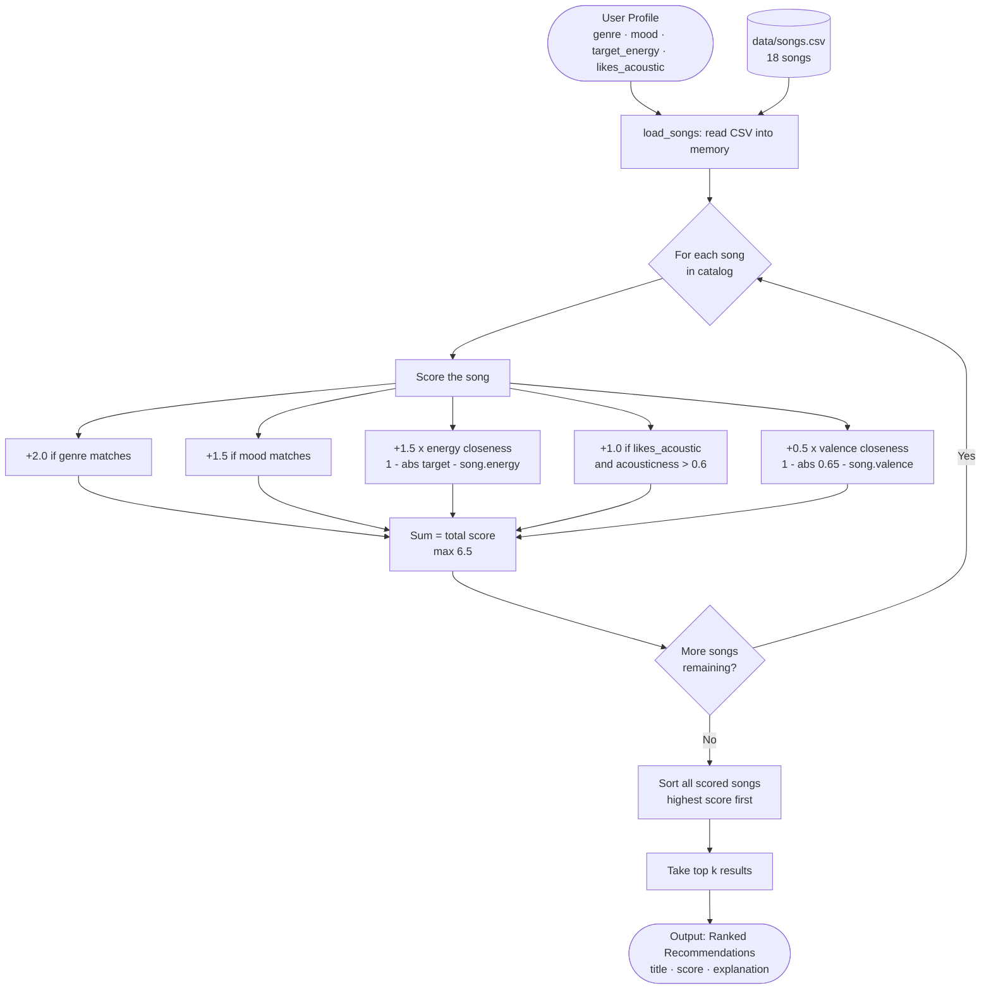

# 🎵 Music Recommender Simulation

## Project Summary

In this project you will build and explain a small music recommender system.

Your goal is to:

- Represent songs and a user "taste profile" as data
- Design a scoring rule that turns that data into recommendations
- Evaluate what your system gets right and wrong
- Reflect on how this mirrors real world AI recommenders

This simulation builds a content-based music recommender that scores each song in a small catalog against a user's stated taste profile. It prioritizes genre and mood as the strongest signals, then uses the closeness of a song's energy level to the user's target energy, with optional bonuses for acoustic preference and valence. The top-k highest-scoring songs are returned as recommendations, along with a plain-language explanation of why each song was chosen.

---

## How The System Works

Real-world recommenders like Spotify or YouTube use two main strategies: **collaborative filtering**, which finds patterns across millions of users ("people like you also liked..."), and **content-based filtering**, which matches a song's measurable attributes to a user's known preferences. At scale these are combined into hybrid systems, but they all share the same core idea: turn both the user and every song into numbers, then find the closest match.

This simulation uses a **pure content-based approach**. Every song and every user is represented as a set of features. The recommender computes a weighted score for each song, then ranks them and returns the top results. Genre and mood mismatches are treated as hard penalties (they carry the most weight), while numeric features like energy are rewarded for closeness to the user's target rather than for simply being high or low. This mirrors how real systems reward relevance over raw popularity.

### Song features

Each `Song` object stores:

- `genre` — broad stylistic category (pop, lofi, rock, ambient, jazz, synthwave, indie pop)
- `mood` — emotional tone (happy, chill, intense, relaxed, moody, focused)
- `energy` — 0.0 to 1.0, how loud and active the track feels
- `tempo_bpm` — beats per minute
- `valence` — 0.0 to 1.0, musical positiveness (high = upbeat, low = dark)
- `danceability` — 0.0 to 1.0, rhythmic suitability for dancing
- `acousticness` — 0.0 to 1.0, acoustic vs. electronic/produced sound

### UserProfile features

Each `UserProfile` stores:

- `favorite_genre` — the genre the user most wants to hear
- `favorite_mood` — the emotional tone they are looking for right now
- `target_energy` — their preferred energy level on a 0.0 to 1.0 scale
- `likes_acoustic` — boolean flag, true if they prefer acoustic over electronic sound

### Scoring and ranking

1. **Score each song** using a weighted formula:
   - Genre match: +2.0 points (binary)
   - Mood match: +1.5 points (binary)
   - Energy closeness: `(1 - |target_energy - song.energy|) x 1.5`
   - Acoustic bonus: +1.0 if `likes_acoustic` is true and `song.acousticness > 0.6`
   - Valence closeness: `(1 - |0.65 - song.valence|) x 0.5`
2. **Rank all songs** by score, highest first
3. **Return the top k songs** along with a plain-language explanation for each

### Data flow diagram



---

## Getting Started

### Setup

1. Create a virtual environment (optional but recommended):

   ```bash
   python -m venv .venv
   source .venv/bin/activate      # Mac or Linux
   .venv\Scripts\activate         # Windows

2. Install dependencies

```bash
pip install -r requirements.txt
```

3. Run the app:

```bash
python -m src.main
```

### Sample Terminal Output

Running with the default **Pop / Happy** profile (`python main.py` from `src/`):

```
Catalog loaded: 18 songs

============================================================
  Profile : Pop / Happy
  Genre   : pop   Mood: happy
  Energy  : 0.8   Acoustic: False
============================================================

  #1  Sunrise City by Neon Echo
       Score : 5.38 / 6.5
       Genre : pop  |  Mood: happy  |  Energy: 0.82
       Why   :
         - genre match - pop (+2.0)
         - mood match - happy (+1.5)
         - energy 0.82 vs target 0.8 -> closeness 0.98 (+1.47)
         - valence 0.84 -> closeness 0.81 (+0.41)

  #2  Gym Hero by Max Pulse
       Score : 3.74 / 6.5
       Genre : pop  |  Mood: intense  |  Energy: 0.93
       Why   :
         - genre match - pop (+2.0)
         - energy 0.93 vs target 0.8 -> closeness 0.87 (+1.3)
         - valence 0.77 -> closeness 0.88 (+0.44)

  #3  Rooftop Lights by Indigo Parade
       Score : 3.36 / 6.5
       Genre : indie pop  |  Mood: happy  |  Energy: 0.76
       Why   :
         - mood match - happy (+1.5)
         - energy 0.76 vs target 0.8 -> closeness 0.96 (+1.44)
         - valence 0.81 -> closeness 0.84 (+0.42)

  #4  Crown Up by Verse Capital
       Score : 1.94 / 6.5
       Genre : hip-hop  |  Mood: confident  |  Energy: 0.78
       Why   :
         - energy 0.78 vs target 0.8 -> closeness 0.98 (+1.47)
         - valence 0.72 -> closeness 0.93 (+0.47)

  #5  Night Drive Loop by Neon Echo
       Score : 1.84 / 6.5
       Genre : synthwave  |  Mood: moody  |  Energy: 0.75
       Why   :
         - energy 0.75 vs target 0.8 -> closeness 0.95 (+1.42)
         - valence 0.49 -> closeness 0.84 (+0.42)

------------------------------------------------------------
```

### Running Tests

Run the starter tests with:

```bash
pytest
```

You can add more tests in `tests/test_recommender.py`.

---

## Experiments You Tried

Use this section to document the experiments you ran. For example:

- What happened when you changed the weight on genre from 2.0 to 0.5
- What happened when you added tempo or valence to the score
- How did your system behave for different types of users

---

## Limitations and Risks

Summarize some limitations of your recommender.

Examples:

- It only works on a tiny catalog
- It does not understand lyrics or language
- It might over favor one genre or mood

You will go deeper on this in your model card.

---

## Reflection

Read and complete `model_card.md`:

[**Model Card**](model_card.md)

Write 1 to 2 paragraphs here about what you learned:

- about how recommenders turn data into predictions
- about where bias or unfairness could show up in systems like this


---

## 7. `model_card_template.md`

Combines reflection and model card framing from the Module 3 guidance. :contentReference[oaicite:2]{index=2}  

```markdown
# 🎧 Model Card - Music Recommender Simulation

## 1. Model Name

Give your recommender a name, for example:

> VibeFinder 1.0

---

## 2. Intended Use

- What is this system trying to do
- Who is it for

Example:

> This model suggests 3 to 5 songs from a small catalog based on a user's preferred genre, mood, and energy level. It is for classroom exploration only, not for real users.

---

## 3. How It Works (Short Explanation)

Describe your scoring logic in plain language.

- What features of each song does it consider
- What information about the user does it use
- How does it turn those into a number

Try to avoid code in this section, treat it like an explanation to a non programmer.

---

## 4. Data

Describe your dataset.

- How many songs are in `data/songs.csv`
- Did you add or remove any songs
- What kinds of genres or moods are represented
- Whose taste does this data mostly reflect

---

## 5. Strengths

Where does your recommender work well

You can think about:
- Situations where the top results "felt right"
- Particular user profiles it served well
- Simplicity or transparency benefits

---

## 6. Limitations and Bias

Where does your recommender struggle

Some prompts:
- Does it ignore some genres or moods
- Does it treat all users as if they have the same taste shape
- Is it biased toward high energy or one genre by default
- How could this be unfair if used in a real product

---

## 7. Evaluation

How did you check your system

Examples:
- You tried multiple user profiles and wrote down whether the results matched your expectations
- You compared your simulation to what a real app like Spotify or YouTube tends to recommend
- You wrote tests for your scoring logic

You do not need a numeric metric, but if you used one, explain what it measures.

---

## 8. Future Work

If you had more time, how would you improve this recommender

Examples:

- Add support for multiple users and "group vibe" recommendations
- Balance diversity of songs instead of always picking the closest match
- Use more features, like tempo ranges or lyric themes

---

## 9. Personal Reflection

A few sentences about what you learned:

- What surprised you about how your system behaved
- How did building this change how you think about real music recommenders
- Where do you think human judgment still matters, even if the model seems "smart"

